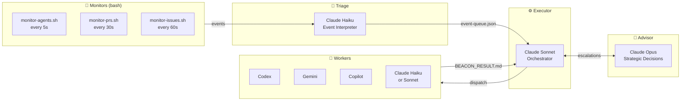

<p align="center">
  
</p>

<h1 align="center">AutoShip</h1>

<p align="center">
  <strong>ship GitHub issues on autopilot</strong>
</p>

<p align="center">
  <a href="https://github.com/Maleick/AutoShip/stargazers"></a>
  <a href="https://github.com/Maleick/AutoShip/commits/main"></a>
  <a href="https://github.com/Maleick/AutoShip/releases"></a>
  <a href="LICENSE"></a>
</p>

<p align="center">
  <a href="#before--after">Before/After</a> •
  <a href="#install">Install</a> •
  <a href="#commands">Commands</a> •
  <a href="#how-it-works">How It Works</a> •
  <a href="#architecture">Architecture</a>
</p>

---

A [Claude Code](https://docs.anthropic.com/en/docs/claude-code) plugin that autonomously routes GitHub issues to AI agents — Codex, Gemini, or Claude — verifies their work, opens pull requests, and merges them. One command starts the loop. You watch it ship.

## Before / After

<table>
<tr>
<td width="50%">

### 📋 Without AutoShip

1. Open GitHub issues backlog
2. Pick an issue manually
3. Open a worktree or branch
4. Assign to Codex / Gemini / Claude
5. Write the dispatch prompt yourself
6. Watch the agent work
7. Review the output
8. Open a PR manually
9. Wait for CI
10. Merge manually
11. Close the issue
12. Repeat × 20 issues

</td>
<td width="50%">

### 🛰️ With AutoShip

```
/autoship:start
```

AutoShip picks issues, dispatches agents, verifies results, opens PRs, waits for CI, merges, closes issues — and loops back for the next one.

You get a dashboard.

</td>
</tr>
</table>

```
┌──────────────────────────────────────────┐
│  ISSUE ROUTING         ████████ AUTO     │
│  AGENT DISPATCH        ████████ AUTO     │
│  PR CREATION           ████████ AUTO     │
│  CI MONITORING         ████████ AUTO     │
│  MERGE + CLOSE         ████████ AUTO     │
│  YOUR EFFORT           █        ~5%      │
└──────────────────────────────────────────┘
```

- **Third-party first** — uses Codex, Gemini, and Copilot before spending Claude tokens
- **Parallel workers** — multiple issues in flight simultaneously
- **Task-type routing** — classifies issues (research/docs/code/ci_fix) and routes to the best agent
- **Configurable routing** — edit `BEACON.md` front matter to change agent priority per task type, live
- **Verification pipeline** — every result reviewed before a PR opens
- **Token ledger** — tracks token spend per issue and per session in `.beacon/token-ledger.json`
- **Event-driven** — bash monitors watch agent output, PRs, and issues in real time
- **Durable state** — survives session restarts via `.beacon/state.json` and GitHub labels

## Install

```bash
claude plugin marketplace add Maleick/AutoShip && claude plugin install autoship@autoship
```

Done. Start a new session and run `/autoship:start`.

### Requirements

- `jq` — JSON processing (`brew install jq`)
- `gh` — GitHub CLI, authenticated (`brew install gh && gh auth login`)
- Git repo with GitHub remote and open issues

### Optional (more agent power)

| Tool            | What it adds                                          |
| --------------- | ----------------------------------------------------- |
| `codex`         | OpenAI-powered worker agents (third-party, preferred) |
| `gemini`        | Google-powered worker agents (third-party, preferred) |
| `gh copilot`    | GitHub Copilot worker agents (via `gh` CLI extension) |
| Claude fallback | Built-in — always available                           |

AutoShip detects available tools at startup and assigns work accordingly.

## Commands

| Command          | What it does                                                      |
| ---------------- | ----------------------------------------------------------------- |
| `/autoship:start`  | Launch orchestration — picks issues, dispatches agents, loops     |
| `/autoship:plan`   | Dry run — analyze issues and show dispatch plan without executing |
| `/autoship:stop`   | Gracefully stop all agents and monitors                           |
| `/autoship:status` | Live dashboard — agents, quota, issue progress                    |

## How It Works

```mermaid
flowchart TD
    A([GitHub Issues]) --> B[/autoship:start]
    B --> C[Classify Issues\ntask-type classifier]

    C -->|research / docs| D[Gemini · Haiku]
    C -->|simple_code / mechanical| E[Codex · Gemini · Copilot]
    C -->|medium_code| F[Codex-GPT · Sonnet]
    C -->|complex| G[Sonnet + Opus advisor]

    D & E & F & G --> H[Create Worktree\nWrite Prompt]
    H --> I[Agent Works]

    I --> J{Status Word}
    J -->|COMPLETE| K[Reviewer verifies\nBEACON_RESULT.md]
    J -->|BLOCKED\nSTUCK| L[Re-dispatch\nor Escalate]

    K -->|PASS| M[Open PR]
    K -->|FAIL| L
    L --> H

    M --> N[Wait for CI]
    N --> O[Merge + Close Issue]
    O --> B
```

Every agent emits `COMPLETE`, `BLOCKED`, or `STUCK` as its final line and writes `BEACON_RESULT.md`. AutoShip never trusts conversation output — only the result file.

## Architecture

Four-tier model: **Bash watches → Haiku thinks → Sonnet orchestrates → Opus advises**



| Tier     | Role                                                  | Model                   |
| -------- | ----------------------------------------------------- | ----------------------- |
| Monitors | 3 bash scripts watching agents, PRs, issues           | bash                    |
| Triage   | Interprets events, categorizes issues, queues actions | Claude Haiku            |
| Executor | Orchestration, dispatch, verification, PR pipeline    | Claude Sonnet           |
| Advisor  | Strategic decisions, UltraPlan, escalations           | Claude Opus             |
| Workers  | Actual code changes                                   | Codex / Gemini / Claude |

State lives in two places: `.beacon/state.json` (local, fast) and GitHub labels (durable, survives restarts).

### Plugin Structure

```
.claude-plugin/
  plugin.json         ← hooks + metadata (wires SessionStart)
  marketplace.json    ← one-liner install target
hooks/
  beacon-activate.sh  ← SessionStart: init + system context injection
  beacon-init.sh      ← create .beacon/ directory structure
  detect-tools.sh     ← detect Codex/Gemini/Copilot availability + quota
  monitor-agents.sh   ← watch pane.log for status words (5s)
  monitor-prs.sh      ← watch PR CI + merge status (30s)
  monitor-issues.sh   ← poll GitHub for new/closed issues (60s)
  update-state.sh            ← write issue state + token counts to state.json
  cleanup-worktree.sh        ← archive result, remove worktree, close issue
  sweep-stale.sh             ← clean orphaned worktrees on startup
  quota-update.sh            ← decay-based API quota estimation
  classify-issue.sh          ← label issues by task type (7 categories)
  dispatch-codex-appserver.sh← drive Codex via JSON-RPC app-server (no tmux)
  emit-event.sh              ← atomic flock write to event-queue.json
  shims/
    gemini-appserver.sh      ← Symphony shim for Gemini CLI
    grok-appserver.sh        ← deprecated — Grok has no OAuth support
skills/
  beacon/             ← orchestration protocol (v3)
  beacon-dispatch/    ← agent dispatch (worktree, prompt, third-party first)
  beacon-verify/      ← post-completion pipeline (verify, PR, merge)
  beacon-status/      ← status dashboard with quota bars
  beacon-poll/        ← GitHub issue sync safety net
agents/
  haiku-triage.md     ← event triage agent
  reviewer.md         ← verification reviewer
commands/
  start.md            ← /autoship:start
  stop.md             ← /autoship:stop
  plan.md             ← /autoship:plan
  status.md           ← /autoship:status
  autoship.md          ← /autoship:autoship (help)
BEACON.md             ← routing matrix + quota config (YAML front matter, hot-reload)
```

## Star This Repo

If AutoShip saves you hours of manual issue routing — leave a star. ⭐

## License

MIT
