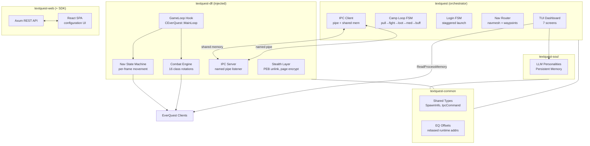

<p align="center">
  
</p>

<p align="center">
  <i>"What happens in Neriak, stays in Neriak."</i>
</p>

<p align="center">
  <a href="https://github.com/Maleick/TextQuest/actions/workflows/ci.yml"></a>
  <a href="https://codecov.io/gh/Maleick/TextQuest"></a>
  <a href="https://github.com/Maleick/TextQuest/releases/tag/v0.7.0-alpha"></a>
  <a href="https://textquest.teamoperator.red"></a>
  <a href="https://github.com/Maleick/TextQuest/commit/56e51b377a72a09d1b9d510045dd78ec1aef10d4"></a>
  <a href="https://www.rust-lang.org/"></a>
  <a href="https://github.com/sponsors/Maleick"></a>
</p>

<p align="center">

[](#testing)
[](#testing)
[](#testing)


</p>

<p align="center">
  <a href="#quick-start">Quick Start</a> •
  <a href="#features">Features</a> •
  <a href="#tui-screens">TUI Screens</a> •
  <a href="#architecture">Architecture</a> •
  <a href="#configuration">Configuration</a> •
  <a href="#roadmap">Roadmap</a> •
  <a href="https://textquest.teamoperator.red">Docs</a>
</p>

<p align="center"><strong>EverQuest multibox controller. One TUI. Full autonomy.</strong></p>

---

A Rust workspace that reads live game state from EverQuest via `ReadProcessMemory`, injects a DLL for direct in-process control, and coordinates multi-client sessions from a TUI-first operator workflow. Compile and test on macOS; live injection, navigation, combat, and login automation require Windows.

```
┌──────────────────────────────────────────┐
│  CAMP AUTOMATION       ████████ AUTO     │
│  LOGIN CHAIN           ████████ AUTO     │
│  NAVIGATION            ████████ AUTO     │
│  COMBAT ROTATION       ████████ AUTO     │
│  MULTI-CLIENT IPC      ████████ AUTO     │
│  YOUR EFFORT           █        ~5%      │
└──────────────────────────────────────────┘
```

## Features

| Category             | What it does                                                                 |
| -------------------- | ---------------------------------------------------------------------------- |
| **DLL Injection**    | Rust `cdylib` injected into running EQ clients via reflective loader         |
| **IPC Pipeline**     | Named pipes for commands (bidirectional) + shared memory for live game state |
| **Camp Automation**  | Six-phase camp loop: pull → fight → loot → med → buff → recover              |
| **Combat Engine**    | Class-driven rotation engine for all 16 classes, CH chain, CC handling       |
| **Login Automation** | Credential store, staggered launch, login FSM, post-login sequencing         |
| **Navigation**       | Navmesh pathfinding (MQ2Nav format), waypoint tooling, stuck detection       |
| **TUI Dashboard**    | Seven-screen operator surface with command mode, themes, privacy mode        |
| **Soul Engine**      | LLM-backed character personalities, persistent memory, social dynamics       |
| **Web Dashboard**    | Axum + React SPA for configuration and monitoring (`textquest-web`)          |
| **Packet Monitor**   | Live WSASend/WSARecv capture with opcode filtering and decode                |

## Quick Start

### Preflight

```bash
python3 scripts/dev-preflight.py
```

Same checks as CI — runs fmt → clippy → test → Python in sequence.

### Build / test (macOS or Windows)

```bash
cargo build
cargo test
cargo clippy --all-targets --all-features -- -D warnings
```

### Live Windows mode

```powershell
cargo build --release
target\release\textquest.exe inject
target\release\textquest.exe tui
```

Common CLI commands:

```powershell
textquest.exe dump
textquest.exe client-status 12345
textquest.exe client-status-all
textquest.exe cmd 12345 "/sit"
textquest.exe navmesh reload gfaydark
textquest.exe navmesh diagnostics --pid 12345
```

## TUI Screens

| Screen           | Key | What you see                                                |
| ---------------- | --- | ----------------------------------------------------------- |
| **Characters**   | `1` | Roster, group scope, selected character detail, DPS meters  |
| **Map**          | `2` | Zone map, spawn positions, named tracker, HVT alerts        |
| **Navigation**   | `3` | Per-character nav status, waypoint queue, route commands    |
| **Debug**        | `4` | Live hex dump, EQ internals offset browser, Ghidra explorer |
| **Packets**      | `5` | Live send/receive opcode stream with filtering              |
| **Economy**      | `6` | Vendor cycle, ledger, plat tracking, loot distribution      |
| **Orchestrator** | `7` | Fleet intent, slot states, signal feed, phase timeline      |

TUI commands start with `:` in command mode. Key bindings:

```text
:status overview      :camp list           :nav <camp|x y z|zone>
:login all            :ch status           :help camp
:inject               :soul <name>         :packet filter <opcode>
```

Full reference: [`docs/wiki/Operating-the-TUI.md`](docs/wiki/Operating-the-TUI.md) · [`docs/wiki/Command-Reference.md`](docs/wiki/Command-Reference.md)

## Architecture


```mermaid
flowchart TD
    subgraph Orchestrator["textquest (orchestrator)"]
        TUI["TUI Dashboard\n7 screens"]
        CampLoop["Camp Loop FSM\npull→fight→loot→med→buff"]
        LoginSM["Login FSM\nstaggered launch"]
        NavRouter["Nav Router\nnavmesh + waypoints"]
        IPC_Client["IPC Client\npipe + shared mem"]
    end

    subgraph DLL["textquest-dll (injected)"]
        GameLoop["GameLoop Hook\nCEverQuest::MainLoop"]
        CombatEngine["Combat Engine\n16 class rotations"]
        NavState["Nav State Machine\nper-frame movement"]
        IPC_Server["IPC Server\nnamed pipe listener"]
        Stealth["Stealth Layer\nPEB unlink, page encrypt"]
    end

    subgraph Common["textquest-common"]
        Types["Shared Types\nSpawnInfo, IpcCommand"]
        Offsets["EQ Offsets\nrebased runtime addrs"]
    end

    subgraph Web["textquest-web (+ SDK)"]
        Axum["Axum REST API"]
        ReactSPA["React SPA\nconfiguration UI"]
    end

    subgraph Soul["textquest-soul"]
        LLM["LLM Personalities\nPersistent Memory"]
    end

    TUI -->|ReadProcessMemory| EQ["EverQuest Clients"]
    IPC_Client <-->|named pipe| IPC_Server
    IPC_Client <-->|shared memory| IPC_Server
    GameLoop --> CombatEngine
    GameLoop --> NavState
    CombatEngine --> EQ
    NavState --> EQ
    TUI --> LLM
    Orchestrator --- Common
    DLL --- Common
    Axum <--> ReactSPA
    Soul --- Common
```

### Workspace crates

| Crate              | Type   | Role                                                         |
| ------------------ | ------ | ------------------------------------------------------------ |
| `textquest`        | bin    | Orchestrator — TUI, camp loop, login, nav, IPC client        |
| `textquest-dll`    | cdylib | Injected DLL — game hooks, combat, nav, IPC server           |
| `textquest-common` | lib    | Shared types, offsets, IPC protocol, spawns, enums           |
| `textquest-client` | lib    | Per-client session management and monitor coordination       |
| `textquest-soul`   | lib    | LLM-backed personalities, persistent memory, social dynamics |
| `textquest-web`    | bin    | Axum REST backend + React SPA for web dashboard and config   |

## Configuration

| File                        | Purpose                                                 |
| --------------------------- | ------------------------------------------------------- |
| `config/textquest.toml`     | Main app config — process, polling, group settings      |
| `config/accounts.toml`      | Per-account name, server, character, class, group       |
| `config/camps/*.toml`       | Camp definitions — zone, pull point/radius, thresholds  |
| `config/classes/*.toml`     | 16 class ability configs with cooldowns and priorities  |
| `config/hvt_watchlist.toml` | High-value target alerts (named mob tracking + Discord) |

Full guide: [`docs/wiki/Configuration.md`](docs/wiki/Configuration.md)

## CI / Automation

| Trigger                    | Jobs                                                                                  |
| -------------------------- | ------------------------------------------------------------------------------------- |
| Pull request / master push | `Merge gate` — one Linux job for secret scan, docs validation, tests, fmt, and clippy |
| Manual/nightly validation  | `nightly-release.yml` — broader Windows release-style validation                      |
| `v*` tag                   | Windows release build + GitHub Release artifacts                                      |

- **Windows runners** (Frostreaver, Tailscale): release, nightly, patch-sensitive validation
- **Linux runners** (DigitalOcean): merge gate, agent automation
- Branch cleanup now happens inside `automation.yml` post-merge handling instead of a separate workflow
- Dev preflight: `python3 scripts/dev-preflight.py`

## Testing

Current workspace totals: 285,998 Rust lines, 4,163 exact tests, and 8 workspace crates. Latest release: v0.7.0-alpha. This line and the badges above are auto-refreshed by `scripts/update_readme_metrics.py`.

```bash
cargo test                                    # full workspace
cargo test -p textquest                       # orchestrator only
cargo test -p textquest-dll                   # DLL (Windows or stubs)
python3 -m unittest discover -s tests -p 'test_*.py' -v
```

Platform-independent tests run on macOS; Windows-only tests are behind `#[cfg(windows)]`. Nightly toolchain required on Windows (`retour` dep).

## Roadmap

| Milestone           | Status     | Description                                           |
| ------------------- | ---------- | ----------------------------------------------------- |
| M1 — Process Reader | ✅ Done    | `ReadProcessMemory`, spawn list, offsets              |
| M2 — Input Dispatch | ✅ Done    | DLL injection, InterpretCmd, IPC pipeline             |
| M3 — Navigation     | ✅ Done    | Navmesh pathfinding, waypoints, stuck recovery        |
| M4 — Login Chain    | ✅ Done    | Credential store, login FSM, post-login sequencing    |
| M5 — Anti-Detection | ✅ Done    | PEB unlink, page encrypt, stack spoof, VEH hooks      |
| M6 — Web Dashboard  | ✅ Done    | Axum REST + React SPA, group builder, loot config     |
| M7 — Zoning         | 🔄 Active  | Zone transition FSM, safe-coordinate validation       |
| M8 — Orchestrator   | 🔄 Active  | Camp loop, CH chain, cross-client coordination        |
| M9 — Hunt Mode      | 🔲 Planned | Tank roam, formation, auto-progression                |
| M10 — Economy       | 🔲 Planned | Krono farming, vendor cycle, loot distribution        |
| M11 — Soul Engine   | 🔲 Planned | LLM personalities, persistent memory, social dynamics |

README stays focused on building, running, and operating TextQuest. The current roadmap keeps economy work at `M10` and Soul Engine + LLM work at `M11`. Soul Engine + LLM behavior is tracked under `M11` in the canonical roadmap, after packet, zoning, anti-cheat, orchestration, and economy work.

Full milestone spec + evidence rules: [`docs/implementation-roadmap.md`](docs/implementation-roadmap.md)

## Documentation

- **Public site**: [textquest.teamoperator.red](https://textquest.teamoperator.red)
- **Quick Start**: [`docs/wiki/Quick-Start.md`](docs/wiki/Quick-Start.md)
- **Build guide**: [`docs/wiki/Installation-and-Build.md`](docs/wiki/Installation-and-Build.md)
- **Local dev (decoupled stack)**: [`docs/dev/local-dev.md`](docs/dev/local-dev.md)
- **TUI operator guide**: [`docs/wiki/Operating-the-TUI.md`](docs/wiki/Operating-the-TUI.md)
- **Command reference**: [`docs/wiki/Command-Reference.md`](docs/wiki/Command-Reference.md)
- **Architecture overview**: [`docs/wiki/Architecture-Overview.md`](docs/wiki/Architecture-Overview.md)
- **Troubleshooting**: [`docs/wiki/Troubleshooting.md`](docs/wiki/Troubleshooting.md)

## Requirements

- **Rust** edition 2024
- **Windows** for live EQ injection and client control
- **Nightly MSVC** on Windows (`retour` depends on unstable features)
- **EverQuest client** for injection, login, navigation, combat

## AI Agent Pipeline

TextQuest uses [AutoShip](https://github.com/Maleick/AutoShip) for autonomous issue routing — GitHub issues are dispatched to OpenCode, OpenAI, Codex, or Claude, verified, and merged automatically.

[](https://github.com/Maleick/AutoShip)
[](https://github.com/sponsors/Maleick)

## License

Private project.
