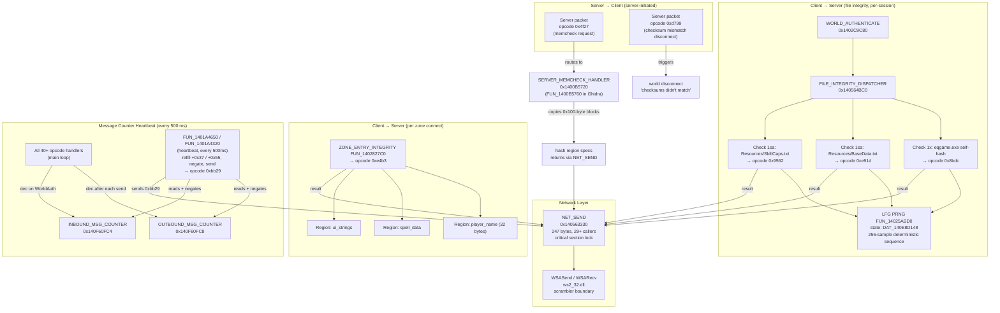

# C4 — Server-Initiated Integrity Callsite Cross-Reference Map

**Issue**: #2187  
**Parent**: #2174  
**Unblocks**: #2175 (A1 server memcheck responder), #2176 (A2 counter watchdog), #2177 (A3 file integrity)  
**Evidence basis**: `docs/wiki/Research-Anti-Detection.md` §Ghidra-Verified Findings; `textquest-common/src/offsets.rs` lines 353–384; Ghidra MCP analysis 2026-04-03; DLL hook source in `textquest-dll/src/hooks/`  
**Date**: 2026-04-21  

---

## 1. Known Entry Points

All addresses use the preferred base `0x140000000`. Rebase at runtime via `offsets::rebase()`.

| Constant | Address | Description |
|---|---|---|
| `SERVER_MEMCHECK_HANDLER` | `0x1400B5720` | Opcode `0x4f27` handler — returns region hashes to server |
| `FILE_INTEGRITY_DISPATCHER` | `0x140564BC0` | Dispatches three file-hash checks on WorldAuthenticate |
| `OUTBOUND_MSG_COUNTER` | `0x140F60FC8` | Global outbound counter (decremented per opcode handler) |
| `INBOUND_MSG_COUNTER` | `0x140F60FC4` | Global inbound counter (decremented per WorldAuth message) |
| `NET_SEND` | `0x140563330` | Main packet send function — all outbound packets pass through |
| `WORLD_AUTHENTICATE` | `0x1402C9C80` | WorldAuthenticate caller — triggers `FILE_INTEGRITY_DISPATCHER` |
| `ZONE_ENTRY_INTEGRITY` | `0x1402827C0` | Zone-connect integrity reporter — opcode `0xe4b3` |
| `MEMCHECK4_PROCESS_ENUM` | `0x140299120` | Process enumeration anti-cheat scanner (startup + periodic) |
| `SYSTEM_FINGERPRINT` | `0x140594840` | Hardware fingerprint serializer — VideoCardId, MAC, ComputerName |
| `CHEATER_LD_FLAG_VAR` | `0x140AFED90` | Server-set flag persisting ban state across sessions |

---

## 2. Call Graph — All Six Integrity Opcodes



---

## 3. Per-Callsite Classification

### 3.1 SERVER_MEMCHECK_HANDLER — `0x1400B5720` (opcode `0x4f27`)

| Attribute | Value |
|---|---|
| Direction | Server → Client (server sends request, client hashes and replies) |
| Frequency | Per-server-decision (aperiodic); observed during suspicious activity or sampling windows |
| Trigger | Inbound opcode `0x4f27` parsed by the main loop dispatcher |
| Region scope | Any address range; server targets `.text` to detect byte-patch hooks |
| Block granularity | 0x100 bytes per block, FNV-1a variant |
| Return path | Via `NET_SEND` (0x140563330), decrements `OUTBOUND_MSG_COUNTER` |
| HWBP-viable | **YES** — DR3 reserved. No code bytes modified. Circular detection risk if a detour were used instead (the detour bytes would themselves be hashed). |
| TextQuest hook | HWBP on Dr3; clean-hash cache pre-computed at DLL init (`hooks/memcheck.rs`) |
| Known callers | Main loop opcode dispatcher (address TBD — see §5 below) |
| A-series issue | #2175 (A1) |

**Stub status**: Handler entry HWBP fires. Argument parsing (`RCX` region_count / `RDX` spec-array pointer layout) is stubbed pending Ghidra confirmation of `FUN_1400B5720` signature. See `hooks/memcheck.rs` §Callback stub note.

---

### 3.2 FILE_INTEGRITY_DISPATCHER — `0x140564BC0`

| Attribute | Value |
|---|---|
| Direction | Client → Server (proactive, on session connect) |
| Frequency | Per world-connect (per session login, not per zone) |
| Trigger | `WORLD_AUTHENTICATE` (`FUN_1402C9C80`) calls the dispatcher |
| Sub-checks | 3 serial checks (see table below) |
| PRNG | Lagged Fibonacci, p=55 q=24, state `DAT_140E8D148`. Deterministic — server replicates the sequence |
| HWBP-viable | **NO** — DR3 is claimed by #2175. Retour byte-patch detour is used instead |
| TextQuest hook | `retour::static_detour!` passthrough default (`hooks/file_integrity_dispatcher.rs`) |
| A-series issue | #2177 (A3) |

**Sub-checks dispatched by `FILE_INTEGRITY_DISPATCHER`:**

| Check ID | Target | Opcode | Callee in dispatcher | Notes |
|---|---|---|---|---|
| 1x | `eqgame.exe` (self) | `0x8bdc` | inline or sub-call TBD | `GetModuleFileNameA` path — on-disk hash unaffected by HWBP |
| 1sa | `Resources/BaseData.txt` | `0xe91d` | inline or sub-call TBD | vanilla file, no TextQuest modification |
| 1sa | `Resources/SkillCaps.txt` | `0x9562` | inline or sub-call TBD | vanilla file, no TextQuest modification |

**Caller chain for FILE_INTEGRITY_DISPATCHER:**
```
WORLD_AUTHENTICATE (0x1402C9C80)
  └─→ FILE_INTEGRITY_DISPATCHER (0x140564BC0)
        ├─→ [check 1x]  eqgame.exe hash → NET_SEND → opcode 0x8bdc
        ├─→ [check 1sa] BaseData.txt hash → NET_SEND → opcode 0xe91d
        └─→ [check 1sa] SkillCaps.txt hash → NET_SEND → opcode 0x9562
```

---

### 3.3 OUTBOUND_MSG_COUNTER — `0x140F60FC8`

| Attribute | Value |
|---|---|
| Type | Global `i32` (or `u32`) at fixed data-segment address |
| Writers (decrement) | Every opcode handler in the main loop — 40+ sites. Decrement fires **before** calling `NET_SEND` |
| Writers (refill) | `FUN_1401A4650` / heartbeat tick: `+0x37` (outbound refill) every 500 ms |
| Writers (negate) | Same heartbeat: negates both counters and sends via opcode `0xbb29` |
| Writers (reset) | Unknown — needs Ghidra xref sweep of write sites |
| HWBP-viable | **YES** for read-watchpoint; **risky** for write-watchpoint (fires 40+ times per main loop iteration) |
| TextQuest approach | Passive audit: WSASend/WSARecv hooks observe packets post-decrement. Debug-build drift watchdog in `hooks/packet_hook.rs` |
| A-series issue | #2176 (A2) |

**Counter write sites summary:**
```
OUTBOUND_MSG_COUNTER (0x140F60FC8):
  Writers:
    - 40+ opcode handlers (dec by 1 before NET_SEND)       frequency: per outbound packet
    - FUN_1401A4650 heartbeat refill (+0x37)                frequency: every 500 ms
    - FUN_1401A4650 heartbeat negate (×-1)                  frequency: every 500 ms
    - [unknown reset sites — Ghidra sweep needed]

INBOUND_MSG_COUNTER (0x140F60FC4):
  Writers:
    - WorldAuth message handlers (dec by 1)                 frequency: per inbound auth msg
    - FUN_1401A4650 heartbeat refill (+0x55)                frequency: every 500 ms
    - FUN_1401A4650 heartbeat negate (×-1)                  frequency: every 500 ms
    - [unknown reset sites — Ghidra sweep needed]
```

**Critical constraint**: Any future packet injection that calls `NET_SEND` directly (bypassing EQ's opcode handler) **must** perform an atomic `fetch_sub(1, SeqCst)` on `OUTBOUND_MSG_COUNTER` or the server will observe drift and trigger detection.

---

### 3.4 NET_SEND — `0x140563330`

| Attribute | Value |
|---|---|
| Size | 247 bytes |
| Known caller count | 29+ (Ghidra xref, 2026-04-03) |
| Path | EQ opcode handlers → NET_SEND → WSASend (ws2_32.dll) |
| Critical section | Internal lock — not reentrant from arbitrary threads |
| HWBP-viable | **Conditional** — viable as a read-execute breakpoint; congestion risk given 29+ callers. Retour trampoline at `NET_SEND` entry is a viable single-point hook for counter interception |
| TextQuest hook | Not directly hooked; WSASend/WSARecv hooked at Winsock boundary (`hooks/packet_hook.rs`) |
| Counter relationship | Callers decrement `OUTBOUND_MSG_COUNTER` **before** this call |

**Callers classified by trigger path:**

| Caller category | Frequency | Representative path |
|---|---|---|
| Memcheck response | Per server request | `SERVER_MEMCHECK_HANDLER` → `NET_SEND` |
| File integrity responses | Per world-connect × 3 | `FILE_INTEGRITY_DISPATCHER` sub-checks → `NET_SEND` |
| Zone-entry integrity | Per zone connect | `ZONE_ENTRY_INTEGRITY` → `NET_SEND` |
| Counter heartbeat (0xbb29) | Every 500 ms | `FUN_1401A4650` → `NET_SEND` |
| Movement/position | Every ~15 ms | movement opcode handlers → `NET_SEND` |
| Spell / combat / misc | Per player action | various opcode handlers → `NET_SEND` |
| All other main-loop opcodes | Per event | 40+ handlers → `NET_SEND` |

---

### 3.5 ZONE_ENTRY_INTEGRITY — `0x1402827C0` (opcode `0xe4b3`)

| Attribute | Value |
|---|---|
| Direction | Client → Server (per zone connect) |
| Frequency | Per zone-connect (not per session) |
| Trigger | Zone connect callback chain (after zone handshake) |
| Regions hashed | player_name (32 bytes), spell_data, ui_strings |
| HWBP-viable | **NO** — DR3 claimed by #2175. Retour detour in use |
| TextQuest hook | `retour::static_detour!` passthrough + telemetry (`hooks/zone_entry_integrity.rs`) |
| A-series issue | #2178 (scope of #2173 epic) |

---

### 3.6 Checksum Mismatch Disconnect — opcode `0xd799`

| Attribute | Value |
|---|---|
| Direction | Server → Client (server-initiated termination) |
| Trigger | Server sends `"World disconnecting because the checksums didn't match."` |
| Condition | Any integrity check mismatch (memcheck, file hash, counter drift) |
| Hook relevance | Passive monitoring — intercept to log disconnect reason before connection drops |
| Ghidra status | Handler address not yet in `offsets.rs` — needs xref from string reference |

---

## 4. Opcode-to-Handler Dispatch Table

The main loop opcode dispatcher routes inbound opcodes to their handlers. From Ghidra findings, the six A-series opcodes map as follows:

| Opcode | Direction | Handler / Action | Handler Address |
|---|---|---|---|
| `0x4f27` | Inbound (server → client) | `SERVER_MEMCHECK_HANDLER` | `0x1400B5720` |
| `0x8bdc` | Outbound (client → server) | File integrity: `eqgame.exe` self-hash | (sub of `FILE_INTEGRITY_DISPATCHER`) |
| `0xe91d` | Outbound (client → server) | File integrity: `BaseData.txt` hash | (sub of `FILE_INTEGRITY_DISPATCHER`) |
| `0x9562` | Outbound (client → server) | File integrity: `SkillCaps.txt` hash | (sub of `FILE_INTEGRITY_DISPATCHER`) |
| `0xe4b3` | Outbound (client → server) | Zone-entry integrity report | `ZONE_ENTRY_INTEGRITY` (`0x140282_7C0`) |
| `0xd799` | Inbound (server → client) | Checksum-mismatch disconnect | handler address TBD |
| `0xbb29` | Outbound (client → server) | Counter heartbeat (negated counters) | sent by `FUN_1401A4650` |

**Dispatcher architecture assessment**:

The outbound opcodes (`0x8bdc`, `0xe91d`, `0x9562`, `0xe4b3`, `0xbb29`) are constructed by the client handlers and passed to `NET_SEND` — they are not dispatched from a single routing table. Intercepting them requires hooking at the handler level or at `NET_SEND` itself.

The inbound opcodes (`0x4f27`, `0xd799`) are routed by an inbound opcode dispatcher whose address is **not yet confirmed** in `offsets.rs`. Ghidra xref from `SERVER_MEMCHECK_HANDLER` (look for its single call site in the inbound dispatch chain) would locate the dispatcher. This is the candidate for a single-hook-covers-all-six-opcodes approach.

---

## 5. Open Gaps — Ghidra Sweep Needed

The following addresses are referenced in the codebase but **not yet confirmed** in `offsets.rs`:

| Address / Symbol | What it is | How to find it |
|---|---|---|
| Inbound opcode dispatcher | Routes `0x4f27` → `SERVER_MEMCHECK_HANDLER` and `0xd799` to its handler | Xref callers of `SERVER_MEMCHECK_HANDLER`; the one non-`NET_SEND` site is the dispatcher |
| `FUN_1401A4650` / `FUN_1401A4320` | Counter heartbeat — refills, negates, sends `0xbb29` | Xref writers of `OUTBOUND_MSG_COUNTER` that write positive values (refill sites) |
| `0xd799` handler address | Checksum-mismatch disconnect handler | Xref the disconnect string `"World disconnecting because the checksums didn't match."` |
| `OUTBOUND_MSG_COUNTER` reset sites | Any writer that zeros or re-initializes the counter (outside heartbeat) | Xref all writes to `0x140F60FC8` excluding decrement-by-1 and refill-by-0x37 |
| `FUN_14025ABD0` (PRNG) | LFG PRNG used by file integrity checks | Address in Ghidra analysis but not yet added to `offsets.rs` |
| `DAT_140E8D148` (PRNG state) | LFG PRNG state array (55 u32s) | Xref from `FUN_14025ABD0` global reads |

---

## 6. Hook-Point Recommendation for A-Series (#2175 / #2176 / #2177)

### Option A — Hook the Inbound Opcode Dispatcher (single hook, covers `0x4f27` + `0xd799`)

**Trade-offs:**
- Pro: One hook controls both server-initiated inbound integrity opcodes.
- Pro: HWBP-viable if dispatcher is a well-defined function entry.
- Con: Dispatcher address not yet confirmed — requires Ghidra xref of `SERVER_MEMCHECK_HANDLER` callers.
- Con: Dispatcher may be inside the main loop body (unverifiable via 20 KB decompiler timeout risk).

### Option B — Hook Each Handler Individually (current approach)

**Trade-offs:**
- Pro: Already implemented for `SERVER_MEMCHECK_HANDLER` (HWBP Dr3), `FILE_INTEGRITY_DISPATCHER` (retour), `ZONE_ENTRY_INTEGRITY` (retour).
- Pro: No dispatcher address needed.
- Con: Four HWBP slots exhausted; additional integrity hooks must use retour (byte-patch detour — HIGH detection risk per `hook-detection-surface.md`).

### Option C — Hook NET_SEND (single hook, covers all outbound)

**Trade-offs:**
- Pro: All outbound packets (including `0x8bdc`, `0xe91d`, `0x9562`, `0xe4b3`, `0xbb29`) route through `NET_SEND`.
- Pro: One hook point for observability and potential opcode-level filtering.
- Con: `NET_SEND` has 29+ callers — HWBP fires extremely frequently.
- Con: Counter decrement happens **before** `NET_SEND` in each caller; a `NET_SEND` hook cannot see the decrement atomically.
- Con: Retour byte-patch on `NET_SEND` is HIGH risk (code integrity checks hash `.text`).

### Recommendation

**Proceed with Option B** (per-handler hooks, current approach) for A1/A2/A3:

1. `SERVER_MEMCHECK_HANDLER`: HWBP Dr3 — already installed. Complete argument-parsing stub (#2175 scope).
2. `FILE_INTEGRITY_DISPATCHER`: Retour detour — already installed passthrough. Activate spoofing when needed (#2177 scope).
3. `ZONE_ENTRY_INTEGRITY`: Retour detour — already installed. Telemetry live (#2178 scope).
4. Counter audit: Passive watchdog in `WSASend/WSARecv` hooks — already implemented (#2176 scope).

Pursue Option A (dispatcher hook) as a **follow-up** once Ghidra confirms the inbound dispatcher address — it reduces retour surface area and provides a single interception point for future unknown integrity opcodes.

---

## 7. Newly Discovered / Confirmed Addresses for offsets.rs

The following addresses from Ghidra analysis are referenced in code/docs but missing from `offsets.rs`. Added in this issue:

| Constant name | Address | Source |
|---|---|---|
| `COUNTER_HEARTBEAT` | `0x1401A4650` | `Research-Anti-Detection.md` §Message counter heartbeat |
| `COUNTER_HEARTBEAT_SEND` | `0x1401A4320` | Same; sends the negated counters via opcode `0xbb29` |
| `LFG_PRNG` | `0x14025ABD0` | §File integrity checks (PRNG function) |
| `LFG_PRNG_STATE` | `0x140E8D148` | §File integrity checks (PRNG state global) |

See `textquest-common/src/offsets.rs` — these are added in the same commit as this research note.

---

## 8. Evidence Status

| Finding | Confidence | Source |
|---|---|---|
| `SERVER_MEMCHECK_HANDLER` address and opcode `0x4f27` | Live-validated | Ghidra MCP, 2026-04-03 |
| `FILE_INTEGRITY_DISPATCHER` address and 3 sub-opcodes | Live-validated | Ghidra MCP, 2026-04-03 |
| `OUTBOUND_MSG_COUNTER` / `INBOUND_MSG_COUNTER` addresses | Live-validated | Ghidra MCP, 2026-04-03 |
| `NET_SEND` address and 29+ caller count | Live-validated | Ghidra MCP, 2026-04-03 |
| Counter decrement occurs before `NET_SEND` | Live-validated | Ghidra decompile of opcode handlers |
| Heartbeat period 500 ms, opcodes `0xbb29`, refill values | Live-validated | Ghidra MCP, 2026-04-03 |
| PRNG: LFG p=55 q=24, 256 samples | Live-validated | Ghidra decompile of `FUN_14025ABD0` |
| `ZONE_ENTRY_INTEGRITY` address and opcode `0xe4b3` | Live-validated | Ghidra MCP, 2026-04-03 |
| Inbound opcode dispatcher address | **UNKNOWN** | Needs Ghidra xref sweep |
| `0xd799` handler address | **UNKNOWN** | Needs string-reference xref |
| Counter reset/zero sites | **UNKNOWN** | Needs full write-xref sweep |
