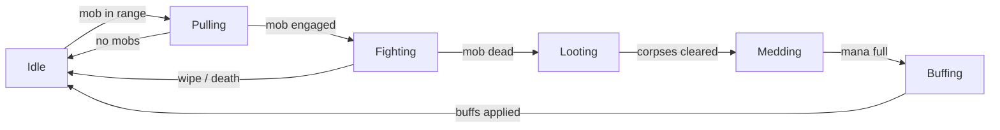
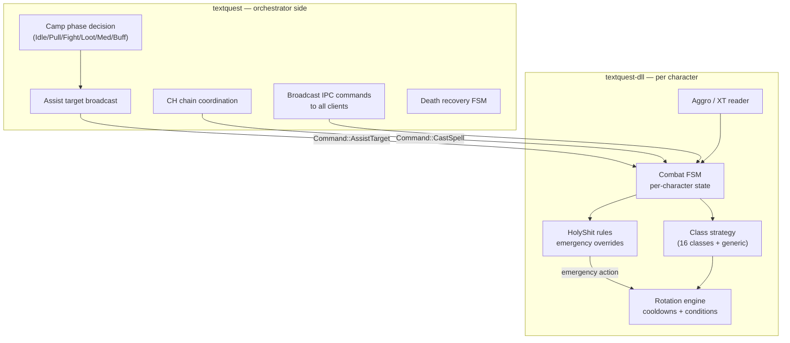

# Combat and Camp Loop

## Current Operator Surface

The main operator commands are:

- `:camp start <name>`
- `:camp stop`
- `:camp status`
- `:mode camp`
- `:mode hunt`
- `:engage [target_id]`
- `:disengage`
- `:ma <name>`
- `:mt <name>`
- `:ch ...`

Camp configs come from `config/camps/*.toml`. Class behavior comes from `config/classes/*.toml`.

## Current Camp Loop State

The current orchestrator-side camp loop in `textquest/src/camp/state.rs` uses these phases:

- `Idle`
- `Pulling`
- `Fighting`
- `Looting`
- `Medding`
- `Buffing`

That matters because older docs may still summarize the system as a simpler five-phase loop. The current code explicitly includes `Buffing`.



### Orchestrator vs DLL responsibility split



## Responsibility Split

### Orchestrator-side responsibilities

Handled mostly in `textquest/src/camp/`, `textquest/src/combat/`, and `textquest/src/orchestrator.rs`:

- build camp membership
- decide the high-level camp or hunt phase
- broadcast slash commands or structured IPC commands
- coordinate CH chains
- manage assist and tank metadata
- track buffs, death recovery, positioning, vendor checks, and camp transitions

### DLL-side responsibilities

Handled mostly in `textquest-dll/src/combat/`:

- per-character combat FSM
- class strategy selection
- target execution and cast timing
- cooldown tracking
- mana governance
- emergency overrides through HolyShit rules
- puller behavior and aggro handling

## CH Chain

The CH chain coordinator lives in `textquest/src/combat/coordinator.rs` and `textquest/src/combat/ch_chain.rs`.

Current command format:

```text
:ch start <pid1,pid2,...> <interval_secs> [target_id] [spell_slot]
```

Current capabilities:

- start and stop a chain
- add and remove clerics
- change interval
- toggle adaptive timing
- set chain target and spell slot through the start parameters

The cleric-side override is honored in the DLL combat strategy layer, where CH can preempt the normal cleric priority flow.

## Current Combat Strategy Coverage

- The DLL has a `ClassStrategy` trait and class-specific implementations.
- The repo currently includes 17 class strategies plus a generic DPS fallback.
- HolyShit emergency rules are evaluated before the normal combat rotation each tick.

## Camp vs Hunt

- `camp` mode stays centered around the configured camp geometry.
- `hunt` mode roams and pulls along broader movement or routing plans.

Both modes are represented in code today, but they are not the same workflow. When documenting or testing changes, keep them separate.

## Survivability-First Automation Constraint

TextQuest's camp loop and combat rotation design are constrained by one rule: unattended automation must prefer wipe avoidance over peak clean-pull DPS. In practice that means the default group template assumes a survivability core of `bard + cleric + second healer/support-healer`, where `shaman` is preferred and `paladin` is the lower-throughput fallback when pickup coverage matters more than raw damage.

This matters because the system is proactive, not reactive:

- it can pre-program recovery behavior
- it cannot improvise like a human boxer when a pull goes bad
- any group that drops below the survivability core must be treated as a utility or reduced-risk exception

### Fallback Behavior Matrix

| Trigger | Orchestrator-side response | DLL / class-layer response | Success condition |
| ------- | -------------------------- | -------------------------- | ----------------- |
| Main tank dies and a configured pickup tank exists | Stop new pulls, freeze aggressive retarget churn, promote the pickup tank, and keep the encounter local to camp instead of expanding the fight | Bard stays on defensive melody, cleric swaps to the pickup tank, paladin or shadowknight takes aggro, DPS drops burn priorities | Group stabilizes without a full wipe |
| Main tank dies and no real pickup tank exists | Suppress new pulls and switch the group from kill mode to stall-and-recover mode | Bard peels, mezes, or kites if possible; secondary healer buys time; DPS stops chasing parse value and helps disengage | Corpse recovery or orderly reset happens before the whole group dies |
| Primary healer dies | Mark the surviving healer as temporary primary, lower mana-floor restrictions for emergency healing, and defer any new pull decision until healer coverage is restored | Shaman or paladin takes direct-heal priority, bard keeps mana and resist songs up, DPS uses mana-light rotation | Encounter survives long enough to finish or disengage |
| Unexpected add or mez resist | Pause assist churn, assign the first add to the configured control/pickup unit, and refuse to progress the pull loop until add state is stable | Bard handles first-line crowd control, paladin or shadowknight picks up if control fails, flex CC reinforces as needed | Kill target and add target are isolated instead of free-casting into the group |
| Survivability core breaks completely (`no second healer`, `no pickup`, or `multiple uncontrolled adds`) | Abort greedy combat continuation and transition to the least-loss recovery path | Druid evac if available; otherwise disengage, regroup, and start corpse recovery | The automation avoids a cascading wipe even if the encounter is lost |

### Design Consequences

- Camp-loop FSM transitions should never assume that operator rescue will arrive within the next tick.
- Rotation engines should bias toward slower but stable behavior whenever healer count, add state, or tank state falls below the safe threshold.
- Utility or logistics groups that do not meet the survivability core should not be scheduled as the unattended default for named camps or unstable dungeon pulls.

## Current Behavior vs Roadmap

### Current behavior

- The orchestrator and DLL split is already real and important.
- CH chain management is an active feature, not only a plan.
- Buff checks, looting, medding, positioning, and pull/fight transitions all exist in current code.

### Validation notes

- Class strategy quality still needs live EQ validation class by class.
- Vendor/sell and more advanced economy loops exist in module structure, but not every path should be treated as fully battle-tested.
