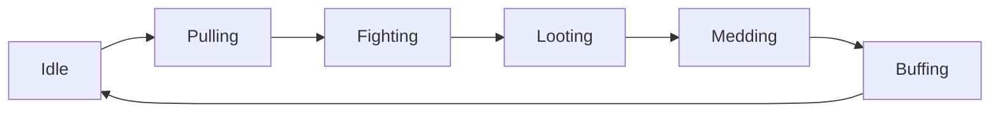

# Combat and Camp Loop

## Current Operator Surface

The main operator commands are:

- `:camp start <name>`
- `:camp stop`
- `:camp status`
- `:mode camp`
- `:mode hunt`
- `:engage [target_id]`
- `:disengage`
- `:ma <name>`
- `:mt <name>`
- `:ch ...`

Camp configs come from `config/camps/*.toml`. Class behavior comes from `config/classes/*.toml`.

## Current Camp Loop State

The current orchestrator-side camp loop in `textquest/src/camp/state.rs` uses these phases:

- `Idle`
- `Pulling`
- `Fighting`
- `Looting`
- `Medding`
- `Buffing`

That matters because older docs may still summarize the system as a simpler five-phase loop. The current code explicitly includes `Buffing`.



## Responsibility Split

### Orchestrator-side responsibilities

Handled mostly in `textquest/src/camp/`, `textquest/src/combat/`, and `textquest/src/orchestrator.rs`:

- build camp membership
- decide the high-level camp or hunt phase
- broadcast slash commands or structured IPC commands
- coordinate CH chains
- manage assist and tank metadata
- track buffs, death recovery, positioning, vendor checks, and camp transitions

### DLL-side responsibilities

Handled mostly in `textquest-dll/src/combat/`:

- per-character combat FSM
- class strategy selection
- target execution and cast timing
- cooldown tracking
- mana governance
- emergency overrides through HolyShit rules
- puller behavior and aggro handling

## CH Chain

The CH chain coordinator lives in `textquest/src/combat/coordinator.rs` and `textquest/src/combat/ch_chain.rs`.

Current command format:

```text
:ch start <pid1,pid2,...> <interval_secs> [target_id] [spell_slot]
```

Current capabilities:

- start and stop a chain
- add and remove clerics
- change interval
- toggle adaptive timing
- set chain target and spell slot through the start parameters

The cleric-side override is honored in the DLL combat strategy layer, where CH can preempt the normal cleric priority flow.

## Current Combat Strategy Coverage

- The DLL has a `ClassStrategy` trait and class-specific implementations.
- The repo currently includes 17 class strategies plus a generic DPS fallback.
- HolyShit emergency rules are evaluated before the normal combat rotation each tick.

## Camp vs Hunt

- `camp` mode stays centered around the configured camp geometry.
- `hunt` mode roams and pulls along broader movement or routing plans.

Both modes are represented in code today, but they are not the same workflow. When documenting or testing changes, keep them separate.

## Current Behavior vs Roadmap

### Current behavior

- The orchestrator and DLL split is already real and important.
- CH chain management is an active feature, not only a plan.
- Buff checks, looting, medding, positioning, and pull/fight transitions all exist in current code.

### Validation notes

- Class strategy quality still needs live EQ validation class by class.
- Vendor/sell and more advanced economy loops exist in module structure, but not every path should be treated as fully battle-tested.
