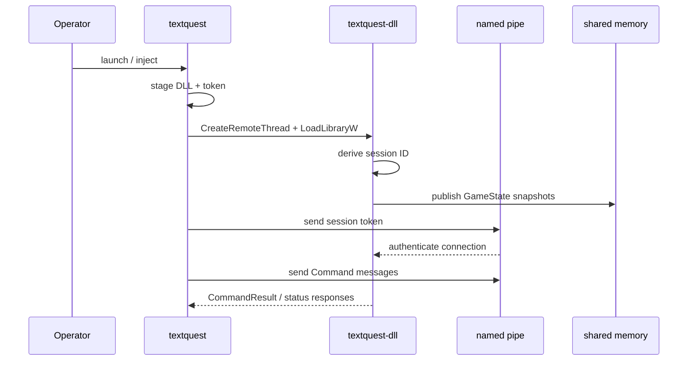

# DLL Injection and IPC Pipeline

## Current Runtime Flow

The live-control path is:

1. Build `textquest_dll.dll`
2. Stage it to a temp location with a randomized filename
3. Write a 32-byte session token for the target PID
4. Inject via `CreateRemoteThread + LoadLibraryW`
5. Let the DLL read the staged token during initialization
6. Derive a session ID from the token
7. Create authenticated IPC surfaces for that client



## Injection Path

The orchestrator-side injection code lives under `textquest/src/inject/`.

Key details:

- `textquest/src/inject/dll_prep.rs` copies the built DLL to a temp directory with a randomized name.
- `textquest/src/inject/loader.rs` uses the classic remote-thread loader path with `LoadLibraryW`.
- `textquest-common/src/ipc.rs` writes `%TEMP%/textquest/token_<pid>.bin` before injection and a retained `%TEMP%/textquest/login_token_<pid>.bin` for later reconnects.

## Session Token and Naming

The shared token is the root of client-specific IPC naming and authentication.

- Token type: 32 random bytes
- Session ID derivation: first 8 bytes interpreted as little-endian `u64`
- Pipe name format: `\\.\pipe\{session_id:x}_cmd_{client_id}`
- Shared memory name format: `{session_id:x}_state_{client_id}`

This is defined in `textquest-common/src/ipc.rs`.

Important nuance:

- The file still keeps legacy `PIPE_NAME_PREFIX` and `SHARED_MEMORY_NAME_PREFIX` constants.
- The active path used by `pipe_name()` and `shared_memory_name()` is session-derived, not the legacy static prefix format.

## Shared Memory Path

The DLL publishes live `GameState` snapshots through a named file mapping created in `textquest-dll/src/ipc/shared.rs`.

Current layout:

```text
[sequence: u64 LE][payload_len: u32 LE][payload: bincode bytes]
```

Behavior:

- odd sequence: write in progress
- even sequence: stable snapshot
- zero sequence: no snapshot written yet

The orchestrator-side reader in `textquest/src/ipc/shared.rs` checks the sequence before and after copying the payload so it can reject torn reads.

The published `GameState` now includes:

- local player vitals
- current target snapshot
- active buffs
- optional pet snapshot

That gives the orchestrator enough state to build a cross-client roster without polling a second IPC path.

## Named Pipe Path

Command delivery is handled by:

- DLL side: `textquest-dll/src/ipc/pipe.rs`
- Orchestrator side: `textquest/src/ipc/pipe.rs`

Connection flow:

1. Orchestrator connects to the client's named pipe
2. Orchestrator sends the raw 32-byte session token as the first message
3. DLL validates the token in constant time
4. If authentication succeeds, subsequent `Command` messages are accepted on that connection

## Security Controls in the Current Code

- Shared memory is created with a current-user DACL and fails closed if DACL setup fails.
- Named pipes are also created with restrictive current-user security attributes.
- Session tokens are random, per injection, and validated on each connection.
- Login passwords are zeroized after use in DLL memory.

## Command and Response Flow

Shared command/response types live in `textquest-common/src/ipc.rs`.

Examples of current command categories:

- movement and navigation
- login automation
- combat control
- loot and utility
- soul chat and idle actions
- slash command execution through EQ internals

Responses include:

- `Pong`
- `CommandResult`
- `NavUpdate`
- `LoginPhaseUpdate`
- `CombatUpdate`
- `ZoneGraph`

The command surface also includes `UpdateSharedClientStates`, which the orchestrator uses to rebroadcast the normalized roster back to every injected client after each state poll.

## Cross-Client Roster Broadcast

TextQuest now has a NetBots-style shared roster layer on top of the per-client shared-memory snapshots:

1. Each DLL publishes `GameState` to its authenticated shared-memory segment.
2. The orchestrator reads those snapshots and normalizes them into `SharedClientState` records.
3. The orchestrator broadcasts the full roster back to every client with `Command::UpdateSharedClientStates`.
4. The orchestrator also writes the latest roster snapshot to `data/runtime/live_sessions.json`.
5. The TUI group panel and web dashboard both read from that normalized roster instead of reconstructing state independently.

The JSON snapshot is mutable runtime state, not canonical evidence. It exists so the web process can render live session status without attaching directly to each client pipe.

## Current Behavior vs Roadmap

### Current behavior

- Injection, token staging, shared-memory publishing, and authenticated pipe control are implemented today.
- The DLL is the code that actually crosses the boundary from operator intent into EQ internal function calls.

### Validation notes and remaining risk

- Any live EQ patch can invalidate offsets or widget assumptions, so injection and login behavior always need Windows validation after upstream changes.
- If the DLL log stops updating or shared memory is unreadable, treat that as a real pipeline failure rather than a UI-only issue.

## Further Reading

- **[IPC Protocol Specification](../specs/ipc-protocol.md)** — Detailed message types, command/response formats, and naming conventions
