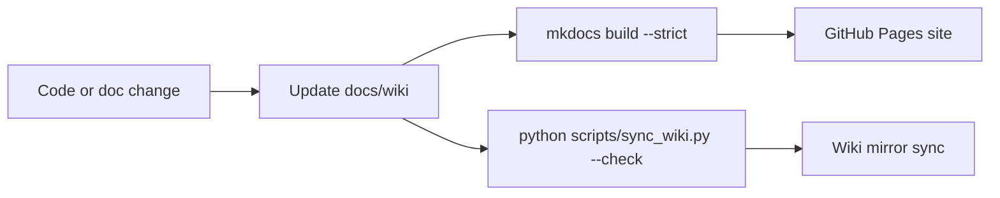

# Development Workflow

## Documentation Split

- `README.md` is the quick usage and run/build entrypoint.
- `docs/wiki/` is the canonical operator, developer, workflow, and runbook surface.
- The GitHub wiki is a lightweight published landing page sourced from `docs/wiki/`, not a second source of truth.
- `TextQuest-Ghidra` is canonical for immutable snapshots, manifests, baseline selection, curated Ghidra evidence, and Ghidra intake and analysis flow.
- `TextQuest` is canonical for code, `docs/wiki/`, runbooks, automation, and lightweight references that point at canonical evidence.
- `AGENTS.md` defines the autonomous issue-worker contract and master-safe migration rules.

## Daily Working Loop

### 1. Build and test

Use the normal Rust flow from the repo root:

```bash
cargo build
cargo fmt --check
cargo clippy --all-targets --all-features -- -D warnings
cargo test
```

For release validation on Windows:

```bash
cargo build --release
```

### 2. Pick the right validation mode

#### UI and orchestration changes

- prefer demo mode first
- iterate with `cargo run`
- confirm the five main screens, command bar, and scope controls

#### Injection, packet, zoning, login, and live combat changes

- use Windows
- validate against live EQ clients
- capture logs and state what was and was not revalidated

### 3. Keep docs aligned with behavior

When behavior or roadmap guidance changes:

1. update the code or source docs
2. update the matching page in `docs/wiki/`
3. run `python scripts/sync_wiki.py --check`
4. run `mkdocs build --strict` to confirm the public docs site still builds
5. run `python scripts/sync_wiki.py --dry-run` before a manual wiki publish
6. include the wiki source changes in the same PR when possible

## CI lanes

- `ci.yml` is the only routine merge gate. It runs Linux-based wiki validation, Python tests, Rust format/lint/test, and secret scanning.
- `nightly-release.yml` is the broader Windows/manual validation lane. Use it for release-like confidence and patch-sensitive pipeline checks.
- `release.yml` remains the tagged release lane for shipping releases after merge safety has already passed.
- Repo automation workflows are operational helpers, not product-health signals. Failures there should be triaged separately from merge safety.

## Roadmap and Tracking Workflow

Live is the primary product target going forward. Test is historical and reference-only.

Supporting research surfaces live in private notes and repository issues. The public site only publishes the validated, public-safe subset of that work.

Raw local harvests, cloned reference repos, and scratch analysis caches do not belong in the tracked repo surface:

- keep repo-root `research/` as ignored local scratch only
- promote durable conclusions into `docs/wiki/` or the issue tracker before relying on them in roadmap or operator workflow
- link to canonical `TextQuest-Ghidra` evidence when the conclusion depends on immutable snapshots or manifests

Current packet/zoning intake rule:

- curate send-path, state, and validation conclusions into the issue tracker and the private research notes before treating raw imports as roadmap-ready

Rules:

- external research may add milestone slices, validation tasks, and evidence updates
- external research may not reorder milestones on its own
- use evidence states when promoting research into execution work
- if a gap is still real after an audit or migration pass, open or update a strict GitHub issue immediately
- use GitHub issues as the default unit of work
- use milestones as release and initiative grouping buckets
- use PRs as the implementation and review unit
- keep GitHub Projects retired and historical-only; do not use them as live queue state
- use sub-issues only for true epics or release buckets
- keep parent epic issues open as coordination shells until their child issues are complete
- prefer multiple focused master-based PRs over one large migration PR
- do not merge Test offsets, Test defaults, or Test-only workflow assumptions into `master`

Default roadmap verifier:

- `python scripts/validate_roadmap_unknowns.py --plan docs/implementation-roadmap.md --domains packet,zoning,anticheat`

## Maintainer Notes

- Base every new branch on fresh `origin/master`.
- The active queue policy lives in `AGENTS.md`; treat older project-mirror guidance as historical context only.
- `scripts/reconcile-agent-queue.sh` and `scripts/sync_project.py` remain legacy transition tools while GitHub Projects retire; they are not part of the normal build-run loop.
- Link to canonical `TextQuest-Ghidra` snapshot or manifest paths instead of copying immutable evidence payloads into this repo.
- Do not commit transient automation state. Keep current autoresearch runtime under `.claude/autoresearch/`, and treat legacy root spills such as `autoresearch-state.json` or `research-results.tsv` as local-only cleanup targets.



## Logging and Debugging

Primary log locations:

- `logs/textquest.log`
- `%TEMP%/textquest/textquest-dll.log`

When debugging IPC or injection:

- verify the session token files exist
- verify the DLL log is updating
- verify `client-status` or `client-status-all` can read live shared memory

## Generated and Derived Files

Do not hand-edit generated sources without also updating the generator flow:

- `HANDOFF.md` is generated by `scripts/gen-handoff.sh`

## Internals and Reference Discipline

- prefer current code over older design docs when there is a conflict
- prefer checked-in code and docs first
- use public upstream references when you need external context
- use MacroQuest docs, RedGuides docs, and public comparison repos as roadmap inputs, not as proof that TextQuest already implements a feature

## Current Behavior vs Roadmap

### Current behavior

- demo mode is the standard inner loop for non-Windows development
- CI validates wiki structure with `python scripts/sync_wiki.py --check`

### Validation notes

- passing tests on macOS does not validate Windows-only injection, packet, zoning, or login paths
- offset and widget-sensitive changes still require live-client verification after EQ updates
