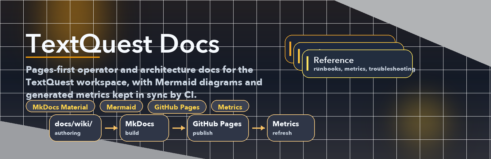

# TextQuest Docs

TextQuest is a Rust workspace for operating and automating EverQuest clients in two layers:

- `textquest`: the external orchestrator, TUI, config loader, launcher, and camp logic
- `textquest-dll`: the injected DLL that runs inside `eqgame.exe`
- `textquest-common`: shared IPC, offsets, nav, combat, login, and soul types
- `textquest-web`: the web/dashboard surface for configuration and monitoring work

This site is the published public docs surface. The repo-side `docs/wiki/` tree remains the authoring source for both the public Pages build and the lightweight wiki mirror.

[Open the docs site](https://maleick.github.io/TextQuest/){ .md-button .md-button--primary }
[Sponsor TextQuest](https://github.com/sponsors/Maleick){ .md-button }

## Start Here

### Canonical Operator Surfaces

- [Quick Start](Quick-Start.md)
- [Operator Guide](Operator-Guide.md)
- [Operator Playbooks](Operator-Playbooks.md)
- [VEH & UAF Injection](Anti-Cheat-VEH-UAF-Injection.md)
- [Deep Dive: Injection, Memory, VEH](Anti-Cheat-Deep-Dive-Injection-Memory-VEH.md)

### Operators

- [Quick Start](Quick-Start.md)
- [Installation and Build](Installation-and-Build.md)
- [Operating the TUI](Operating-the-TUI.md)
- [Map Hotkeys and Controls](Map-Hotkeys-and-Controls.md)
- [Command Reference](Command-Reference.md)
- [Epic Quest Sequencing](Epic-Quest-Sequencing.md)
- [Troubleshooting](Troubleshooting.md)
- [Project Metrics](Project-Metrics.md)
- [Frostreaver Farming & XP Guide](Frostreaver-Farming-Guide.md)
- [Frostreaver Starting City Logistics](Frostreaver-Starting-City-Logistics.md)
- [P99 Zone Guide](P99-Zone-Guide.md)
- [Frostreaver Cost Model](Frostreaver-Cost-Model.md)

### Developers

- [Architecture Overview](Architecture-Overview)
- [DLL Injection and IPC Pipeline](DLL-Injection-and-IPC-Pipeline)
- [Combat and Camp Loop](Combat-and-Camp-Loop)
- [Navigation and Maps](Navigation-and-Maps)
- [Login Automation](Login-Automation)
- [Soul Engine](Soul-Engine)
- [Offsets, EQ Internals, and MacroQuest References](Offsets-EQ-Internals-and-MacroQuest-References)
- [Development Workflow](Development-Workflow)
- [Roadmap and Known Gaps](Roadmap-and-Known-Gaps)
- [Maintaining the Wiki](Maintaining-the-Wiki)

## Current Snapshot

- The production target is Windows with live EverQuest clients.
- Live is the primary product target going forward; Test is historical/reference-only.
- Demo mode is the normal experience on macOS/Linux and also on Windows when no live EQ client is attached.
- The TUI currently exposes five main screens: Characters, Map, Navigation, Debug, and Packets.
- Login automation, DLL injection, navigation, CH chain management, and the Soul Engine are all present in the repository today.
- README is intentionally the quick usage surface; deeper operator and developer guidance lives here.
- Immutable snapshots, manifests, baseline selection, and curated Ghidra evidence live in the sibling `TextQuest-Ghidra` repo.

## Source of Truth

Use these files first when validating or updating the wiki:

- `README.md`
- `AGENTS.md`
- `docs/wiki/`
- `CLAUDE.md`
- `textquest/src/main.rs`
- `textquest/src/tui/app.rs`
- `textquest-common/src/ipc.rs`
- `textquest-common/src/offsets.rs`

Repository rules that matter for documentation:

- The canonical wiki source lives in `docs/wiki/`, not only in the GitHub wiki repo.
- Link to canonical `TextQuest-Ghidra` evidence paths instead of duplicating immutable evidence payloads in this repo.

## SDK & Client Libraries

TextQuest exposes its IPC protocol for external applications via multi-language SDK packages.

- [SDK Documentation](https://maleick.github.io/TextQuest/textquest-client/) — mdBook documentation for the SDK surface
- [IPC Protocol Specification](Specs-and-Protocols/IPC-Protocol.md) — Detailed wire protocol documentation

| Language   | Package             | Registry                                               | Status             |
| ---------- | ------------------- | ------------------------------------------------------ | ------------------ |
| Rust       | `textquest-common`  | [crates.io](https://crates.io/crates/textquest-common) | Published (v0.6.0) |
| Python     | `textquest`         | PyPI                                                   | Not yet published  |
| TypeScript | `@textquest/client` | npm                                                    | Not yet published  |

## Current Behavior vs Roadmap

### Current behavior

- The repo supports local demo-driven TUI development without a live EQ process.
- The injected DLL can publish state, receive IPC commands, and drive login, nav, and combat paths on Windows.
- The Soul Engine currently runs with deterministic fallback responders and persistent memory storage.

### Roadmap and validation notes

- The canonical active roadmap now resumes at `M5` Anti-Cheat and keeps economy execution work at `M10` plus Soul/LLM work at `M11`.
- The current code keeps the queue and provider abstraction for Soul behavior, but routine provider-backed chat is not the claimed default operating mode.
- Some live-client behavior still needs regular Windows validation after EQ patches, especially login selectors, offsets, and nav/combat edge cases.
- For recent compile and validation status, see [Roadmap and Known Gaps](Roadmap-and-Known-Gaps).
- Old research docs may still say "Frostreaver"; treat the current product name as TextQuest and prefer code plus current top-level docs if anything conflicts.

## Documentation Policy

- Update the matching page in `docs/wiki/` in the same PR that changes behavior.
- Prefer current code and generated docs over older narrative research notes.
- When behavior is not revalidated on live EQ, say so explicitly instead of presenting it as confirmed.
- Cite checked-in source files first. When outside references still matter, prefer public upstream docs or repository URLs instead of deleted local vendor paths.
