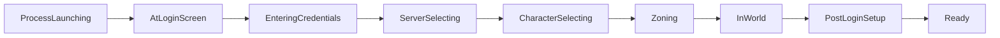
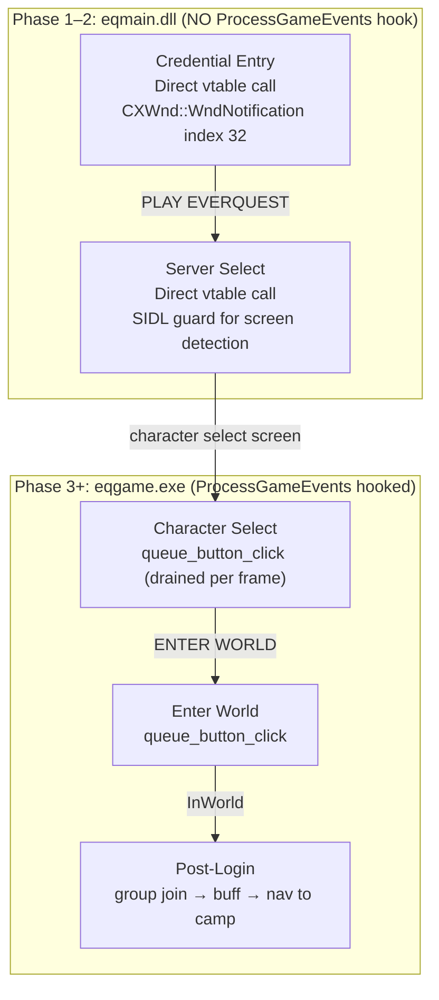

# Login Automation

## Current Operator Workflow

There are two user-facing entry points:

- CLI: `textquest.exe login <account> [--server ...] [--character ...]`
- TUI: `:login`, `:login all`, `:login G<n>`, `:login <account>`
- TUI profile groups: `:profile list`, `:profile launch <name>`, `Ctrl+F1`–`Ctrl+F9`

Account metadata comes from `config/accounts.toml`. Passwords are not stored there.

## Profile Groups

Named profile groups allow launching an entire set of characters with a single command or
keyboard hotkey — matching the MQ2 AutoLogin profile group concept.

### Configuration (`config/accounts.toml`)

```toml
[[accounts]]
name = "frostreaver01"
server = "Firiona Vie"
character = "Camrene"
class = "WAR"
group = 1

[[profile_groups]]
id = 1
name = "MainRaid"
hotkey = "F1"

[[profile_groups]]
id = 2
name = "SecondRaid"
hotkey = "F2"
```

Each `[[profile_groups]]` entry links a human-readable `name` and optional `hotkey` to a
numeric `id` that matches `AccountEntry::group`.

### TUI Commands

| Command                  | Effect                                               |
| ------------------------ | ---------------------------------------------------- |
| `:profile list`          | List all profile groups with hotkey and online count |
| `:profile launch <name>` | Queue all accounts in the named profile for launch   |
| `Ctrl+F1`–`Ctrl+F9`      | Launch the profile group assigned to that hotkey     |

The `:login G<n>` command continues to work for numeric group targeting.

## Current State Model

Shared login phases are defined in `textquest-common/src/login.rs`:

- `NotStarted`
- `ProcessLaunching`
- `AtLoginScreen`
- `EnteringCredentials`
- `ServerSelecting`
- `CharacterSelecting`
- `Zoning`
- `InWorld`
- `PostLoginSetup`
- `Ready`
- `Failed { reason }`



## Current Implementation Split

### Orchestrator side

Handled under `textquest/src/launcher/`:

- `spawner.rs`: start EQ clients
- `login_sm.rs`: external login state machine and launch flow
- `coordinator.rs`: staggered launch coordination and failure handling
- `post_login.rs`: group join, buff, and navigate-to-camp sequencing

### DLL side

Handled under `textquest-dll/src/login/`:

- resolve login UI state
- write credentials into login widgets
- select server
- select character
- enter world

The DLL is the part that actually manipulates EQ's login UI.

## Credentials

Current repo behavior:

- `config/accounts.toml` stores account names, server, character, class, group metadata, and profile group definitions
- encrypted credential storage lives under `textquest/src/credentials/`
- crypto uses Argon2id plus AES-256-GCM
- the DLL zeroizes stored password material after credential entry

## Death Auto-Camp

TextQuest now supports unattended death handling that mirrors the MQ2AutoCamp
workflow:

- death is detected from the live per-client game-state pulse
- each toon can enable `auto_camp_on_death` in `config/textquest.toml`
- when death is first observed, TextQuest immediately sends a status alert
- the character waits `camp_delay_secs` before camping so a live rez can land
- after the delay expires, TextQuest dispatches the existing DLL-side `Relog`
  flow, which issues `/camp desktop`
- the relog flow waits `relog_wait_secs` before re-entering credentials and
  logging the character back in

Per-toon TOML shape:

```toml
[[group.toon]]
name = "Aelrindel"
class = "WIZ"
role = "dps"

[group.toon.auto_camp_on_death]
enabled = true
camp_delay_secs = 30
relog_wait_secs = 900
```

Operational notes:

- account metadata still comes from `config/accounts.toml`
- unattended relog resolves passwords from the encrypted credential store when
  `TEXTQUEST_MASTER_PASSWORD` is set
- if no per-account credential is available, TextQuest falls back to the shared
  `TEXTQUEST_PASSWORD` environment variable
- status notifications use the existing Discord webhook routing and require
  `discord.alert_status = true`
- the dashboard character-config API now exposes the same
  `auto_camp_on_death` fields for per-character editing

## Post-Login Sequencing

The post-login sequencer in `textquest/src/launcher/post_login.rs` currently models:

- joining the designated group
- applying buffs
- navigating to camp
- reporting ready

Shared IPC commands already exist for:

- `JoinGroup`
- `ApplyBuffs`
- `ReportReady`

## Important Platform Note

The TUI `:login` and `:profile launch` flows are stubbed on non-Windows. In that environment they log what would have launched instead of controlling live EQ.

## eqmain vs Game Loop Boundary

The login process crosses a critical architectural boundary — before and after `ProcessGameEvents` is hooked:



> **Key lesson**: Queued clicks are silently dropped during `eqmain` phases because `ProcessGameEvents` is not yet hooked. Use direct vtable calls for Phases 1–2.

## Login Chain Fixes (April 2026)

Three targeted fixes hardened the login chain after live testing revealed that the
DLL's button-click queue mechanism does not work during `eqmain.dll` phases:

### Root cause

`ProcessGameEvents` is not hooked during the `eqmain` phase (pre-server-select).
The DLL's `queue_button_click` mechanism relies on the `ProcessGameEvents` hook to
drain the click queue each frame. Since this hook only activates after the game loop
starts (post-character-select), queued clicks during Phases 1 and 2 were silently
dropped.

### Phase 1 — Credential entry (eqmain)

- **Fix**: Click the LOGIN button directly via vtable call instead of queueing
- Scans for both `"LOGIN"` and `"Login"` button name candidates before selecting
- Uses `CXWnd::WndNotification` vtable call (index 32) for immediate execution
- Commit: `1936c4b07`, `0ec24b77d`

### Phase 2 — Server select (eqmain)

- **Fix**: Click the PLAY EVERQUEST button directly via vtable call
- Added SIDL guard for reliable server-select screen detection
- Same direct vtable mechanism as Phase 1
- Commit: `6c42cda73`

### Phase 3 — Character select and enter world (game loop)

- No changes needed — `ProcessGameEvents` hook is active during the game loop,
  so the existing `queue_button_click` mechanism works correctly for character
  select and enter world

### Key lesson

The eqmain/game-loop boundary is a critical architectural seam. Any UI automation
that runs before `ProcessGameEvents` is hooked must use direct vtable calls, not
the queued click system. This applies to login, server select, and any future
pre-game-loop UI interactions.

## Current Behavior vs Roadmap

### Current behavior

- Login automation is no longer just a design note; the code has real phase models and in-client login logic.
- The launch coordinator already tracks stagger timing, retries, and pause conditions for mass failures.
- Login retry scheduling logs now redact account names and rely on `client_id`, retry attempt, and backoff delay for troubleshooting.
- Profile groups add named, hotkey-accessible multi-character launch profiles (MQ2 parity).

### Validation notes

- Login selectors and widget offsets are some of the most EQ-patch-sensitive parts of the repo.
- Post-login group formation and buff/camp sequencing are structured in code, but they still need repeated live validation on Windows with actual clients.
