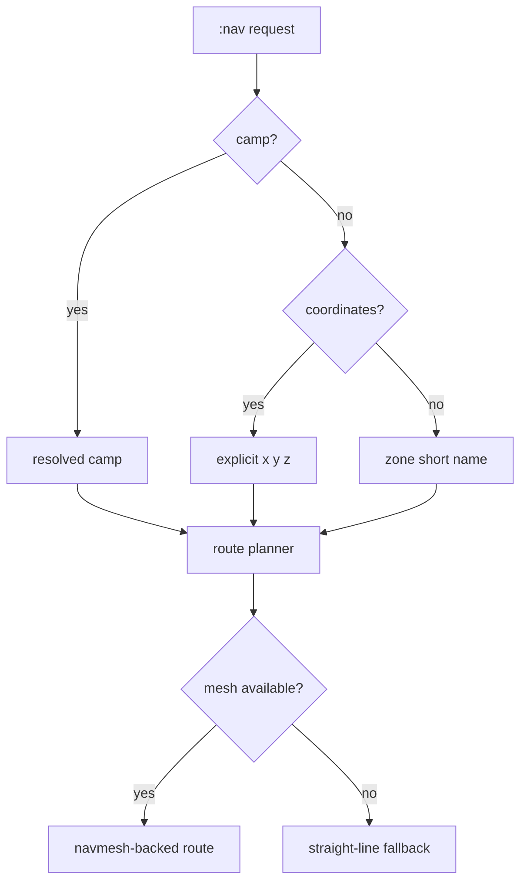
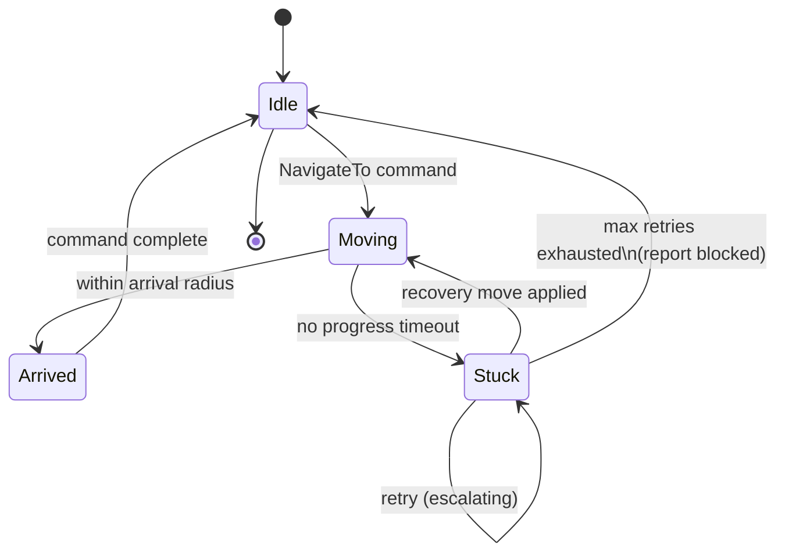

# Navigation and Maps

## Current Operator Workflow

The navigation surface is spread across:

- the Map screen
- the Navigation screen
- `:nav <camp_name|x y z|zone>`
- `:camp next` and `:camp prev`

Map assets currently come from `config/maps/*.txt`, following the Brewall-style zone map format already used by the repo.

## Current Navigation Behavior

When you issue `:nav`, TextQuest tries to resolve the destination as:

1. a saved camp
2. explicit coordinates
3. a zone short name

Per-client results are then sent through `textquest_common::ipc::Command::NavigateTo`.

Possible route sources in current code:

- navmesh-backed route
- straight-line fallback

The TUI reports which path source was used while updating per-client nav state.

## Navmesh and Zone Routing

The core implementation is in `textquest/src/nav/mesh.rs` and `textquest-common/src/nav.rs`.

Current facts:

- TextQuest reads MQ2Nav-format navmesh files
- the mesh payload is loaded into Detour
- zone-to-zone planning uses `ZoneGraph` BFS
- nav status is reported as `Idle`, `Moving`, `Stuck`, or `Arrived`

The zone graph model is shared in `textquest-common/src/nav.rs`, and live zone graph data can be queried from an injected client with the CLI `zones` command.

## TUI Map Features

The Map screen currently supports:

- zone line and label rendering from `config/maps`
- spawn overlays
- compact `OTD` target-direction overlay with live heading and range to the current target
- selected-character location display
- named tracking overlays
- adjustable Z slice
- nav path overlays
- navmesh overlay toggle when mesh data is available

The map directory lookup is handled in `textquest/src/tui/state.rs`.

For the current operator-facing key table, viewport presets, and focused-map shortcut rules, see [Map Hotkeys and Controls](Map-Hotkeys-and-Controls).

## Demo Mode Notes

Demo mode still exercises:

- map rendering
- navigation status widgets
- waypoint overlays
- stuck-state presentation

That makes it useful for UI validation, but it does not prove live movement correctness.

## Nav State Machine (DLL side)

Movement humanization applies during `Moving`: per-character speed jitter, heading wobble, and random micro-detours break up bot-like straight-line pathing.

## Internals

### Orchestrator side

- `textquest/src/nav/mesh.rs`: mesh parsing, route planning, overlay loading
- `textquest/src/nav/recorder.rs`: waypoint capture and simplification
- `textquest/src/nav/router.rs`: route and step abstractions

### DLL side

- `textquest-dll/src/nav/state.rs`: navigator FSM
- `textquest-dll/src/nav/stuck.rs`: stuck detection and escalating recovery
- `textquest-dll/src/nav/humanize.rs`: detours and movement variation

## Current Behavior vs Roadmap

### Current behavior

- MQ2Nav-style navmesh support and Detour integration are part of the repo today.
- Straight-line fallback is deliberate only for navmesh data gaps or unavailable mesh data.
- If a mesh exists but no safe corridor can be planned, TextQuest now reports a blocked route and recommends replanning instead of taking a direct shortcut through walls.

### Validation notes

- Map overlays and nav paths render well in demo mode, but live heading/orientation and per-zone movement still need Windows validation after patches.
- Non-Windows builds intentionally skip live navmesh overlay loading.
