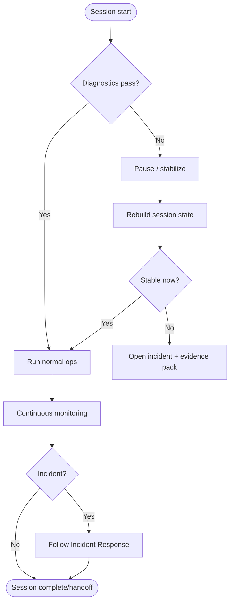

# Operator Playbooks

Use this page as the canonical operator playbook index.

## Daily Start Playbook

### Checklist

1. Verify target game client and operator account status.
2. Confirm the latest evidence pack is loaded.
3. Start the operator session from the main launcher.
4. Validate:
   - Baseline offsets loaded
   - Required DLL hooks active
   - UI refresh cycle is healthy
5. Capture first session log snapshot before running automations.

### Notes

- Keep this page aligned with [`Operator-Guide`](Operator-Guide.md) for command semantics.
- Prefer this sequence over one-off docs in feature branches.

## Incident Response Playbook

### Scenario: Session desync or stale status

1. Pause non-critical automations.
2. Rebuild local session context and re-run quick diagnostics.
3. If hooks are not stable, stop gracefully and restart in `maintenance` order.
4. Record root cause in notes and escalate only if repeated on two consecutive sessions.

### Scenario: Build/offset mismatch

1. Stop active operators.
2. Verify local offset version against canonical manifests.
3. Pull latest evidence from `TextQuest-Ghidra` if mismatch is confirmed.
4. Re-run diagnostics before resuming gameplay actions.

## Evidence and Handoff Playbook

### Evidence capture checklist

1. Snapshot of current wiki and config references.
2. Capture session logs around the event window.
3. Include host and environment metadata.
4. Attach reproducibility steps with timestamps.
5. Cross-link to PR or issue ticket for follow-up.

### Handoff

1. Provide a concise "what changed / what happened" timeline.
2. Attach validation output (sync checks, smoke checks).
3. List pending risks and owner assignments.

## Anti-Cheat & Integrity Playbook

### Baseline check

1. Confirm anti-cheat checks are documented in:
   - [`Anti-Cheat-VEH-UAF-Injection`](Anti-Cheat-VEH-UAF-Injection.md)
   - [`Anti-Cheat-Deep-Dive-Injection-Memory-VEH`](Anti-Cheat-Deep-Dive-Injection-Memory-VEH.md)
2. Run integrity verification before startup.
3. Record any deviations and open an issue for unapproved changes.

## Visual flow (operator escalation)

## Canonical page map

- [Home](Home.md) for orientation
- [Quick-Start](Quick-Start.md) for first-run and essentials
- [Operator-Guide](Operator-Guide.md) for command and workflow references
