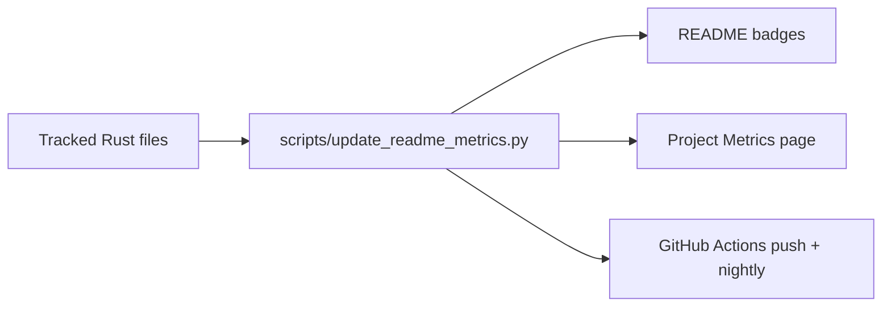

# Project Metrics

Current workspace totals: 208,654 Rust lines across 367 files and ~4,870 tests (2,081 commits as of 2026-04-17). This page and the README badges are auto-refreshed by `scripts/update_readme_metrics.py`.

## What This Tracks

- tracked Rust source lines across the workspace
- exact test count from `cargo test --workspace -- --list` when Cargo is available
- source scan fallback for the test count when the cargo runner is unavailable

## Refresh Flow

## Notes

- The metrics workflow updates the README and this page from the same generator.
- If the cargo test listing fails, the script surfaces the error instead of silently inventing a value.
- The public docs site shows the same numbers that land in the repo README.
