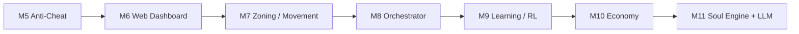

# Roadmap and Known Gaps

The canonical roadmap source is `docs/implementation-roadmap.md`.

Latest repo audit snapshot: `docs/wiki/Repo-Audit-2026-04-13.md`.

This page summarizes the active milestone order, the evidence model, and the main validation gaps that still matter operationally.

README is intentionally the usage surface for TextQuest. Treat this page and `docs/implementation-roadmap.md` as the places for roadmap status and validation guidance.

GitHub tracking for this roadmap lives in issues, linked PRs, and milestones. GitHub Projects are historical/retiring and should not be treated as active defaults.

## Historical Base

These milestones remain part of project history:

- `M1`: external memory reading and TUI dashboard
- `M2`: DLL injection, hooks, IPC, and self-healing monitor
- `M2.5`: login automation and launch coordination
- `M3`: navigation and route handling
- `M4`: combat automation

## Canonical Active Milestone Order

The active roadmap now resumes at `M5`:

- `M5`: Anti-Cheat
- `M6`: Web Dashboard
- `M7`: Zoning/Movement
- `M8`: Orchestrator
- `M9`: Learning/RL
- `M10`: Economy
- `M11`: Soul Engine + LLM (local AI only)

External research may add slices and validation tasks, but it may not reorder milestones on its own.

## Current Validated State

- TUI with five main screens and command bar
- demo mode for non-Windows and no-client workflows
- live Windows injection and authenticated IPC path
- login automation structure and in-client login logic
- navmesh-backed routing and map overlays
- combat FSM plus class strategies and CH chain
- Soul Engine with deterministic fallback and persistent memory
- web/dashboard code is present in the repo, but milestone order and evidence state still come from the canonical roadmap

## Main Gaps Still Requiring Live Validation

- packet-level control paths inferred from research rather than live validation
- the current packet inventory keeps combat, utility, and chat packet seams separate from the existing IPC plus in-process DLL control boundary
- the send pipeline requires opcode scrambling and anti-cheat counter synchronization before any packet-first path can be treated as safe
- zoning state-machine details and recovery behavior after client changes
- offset stability after upstream EQ updates
- cross-zone travel behavior in more zones than the current dev/test set
- class-by-class combat tuning under real combat load
- large-scale multibox validation closer to the 36-client target
- post-login group sequencing and camp setup under real launch conditions
- anti-cheat conclusions beyond explicit public Daybreak policy

## Evidence Model

Every roadmap slice, validation task, or GitHub tracking item should carry one evidence state:

- `Provisional`
- `Research-backed`
- `Needs Live Proof`
- `Live-validated`
- `Invalidated`

Rules:

- `Research-backed` items may enter execution.
- `Live-validated` is required to retire critical unknowns or satisfy milestone exit gates.
- `Provisional` items may stay in research ledgers, but they are not proof of milestone completion.

## Current Research Lane

External research is docs-first and checkpoint-based, but the public site only publishes the validated subset and the issue tracker captures unresolved work.

Current deep-dive order:

1. KissAssist capability audit and TUI translation
2. Joe Multiboxer and JMB orchestration pass
3. MacroQuest Lua and broader runtime pass
4. ongoing Daybreak detection digest updates

Use the issue tracker and private research notes to keep the raw findings organized before promoting them into public docs.

## Current `M8` orchestration guidance

The current JMB comparison keeps `M8` bounded to operator-visible orchestration work:

- formalize routing scopes as `one-toon`, `group`, and `all-session`
- translate launch profile, session preset, and slot lifecycle concepts into TUI-visible state
- keep command routing on the existing authenticated IPC path instead of treating JMB hook examples as direct implementation targets

The current follow-on implementation slices remain:

- #152 for the addressable actor routing abstraction
- #109 for launch profiles, session presets, and slot-health visibility

## Current `M9` learning guidance

`M9` remains a tuning layer on top of stable orchestration and metrics rather than a license to widen runtime authority.

- optimize only operator-visible scorecards such as encounter throughput, recovery success, command latency, and resource efficiency
- require a named baseline, success metric, regression budget, and rollback path before a training-driven candidate can leave draft status
- evaluate candidate changes in replay, shadow, or canary mode before wider live rollout
- keep packet, zoning, anti-cheat, and authenticated IPC boundaries unchanged unless a separate gated milestone explicitly reopens them
- treat training-driven changes as operator-opt-in until live validation proves they do not regress current behavior

## Current `M10` economy guidance

The current economy pass stays intentionally bounded to operator-visible execution loops:

- treat loot intake, distribution, vendor, and banking work as explicit queues and state machines, not as hidden background automation
- reuse the existing authenticated routing and session/group scope model instead of inventing a separate economy control plane
- ship pause/skip/abort/resume controls and economy-facing TUI summaries alongside each loop before claiming a self-sustaining farm workflow
- keep grey-market or off-platform monetization out of scope unless a separate evidence-backed issue explicitly reopens it; current assessment remains blocked in [Grey/Black Market Risk Assessment](Research-Grey-Black-Market-Risk-Assessment)

The current follow-on implementation slices are:

- loot intake plus distribution ownership and reserve rules
- vendor and banking route controllers with failure-state visibility
- plat/item ledger summaries plus operator overrides

## Developer Guidance

When writing docs, PRs, or GitHub tracking items:

- keep roadmap claims anchored to `docs/implementation-roadmap.md`
- separate current behavior from provisional findings
- mark live-validation gaps explicitly
- prefer evidence-state language over vague confidence claims
- treat zoning queue flush, timeout handling, and safe-coordinate recovery as `Needs Live Proof` until current-build validation exists
