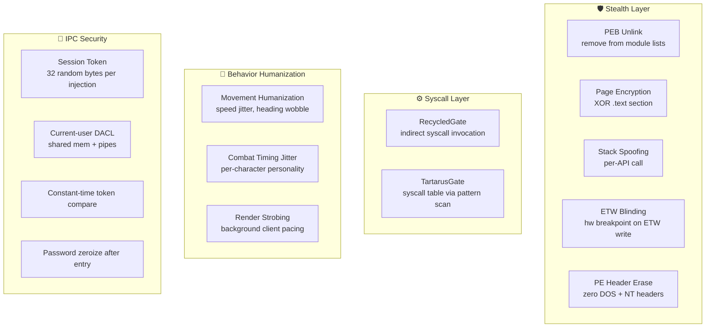

# Security and Anti-Detection Notes

## Canonical Inputs

Use these sources in this order:

1. current code and repo docs
2. `docs/external-research/daybreak-detection-digest.md`
3. official Daybreak policy pages linked from that digest
4. clearly labeled secondary community reporting

Do not present community inference as official detection fact.

## Current Security Measures

From the current codebase:

- session tokens are 32 random bytes generated from OS entropy
- pipe and shared-memory names are derived from the per-session token
- named pipes require the raw token as the first authenticated message
- token comparison in the DLL is constant-time
- shared memory uses a current-user DACL
- named pipes use restrictive current-user security attributes
- login passwords are zeroized after use inside the DLL
- staged DLL filenames are randomized before injection

## Anti-Detection Layers

## Current Operator Implications

- authenticated IPC is per injected session, not just per PID
- reconnect-style commands depend on the retained `login_token_<pid>.bin` file
- if you copy or relaunch clients, do not assume an old token file is still valid
- runner and live-play machines should stay clean of unrelated cheat tooling because Daybreak policy is broader than one game client

## Anti-Detection Research Posture

Current practical measures include:

- randomized DLL staging names
- session-derived IPC names rather than a fixed simple prefix scheme
- movement humanization in the navigation layer
- personality and timing variation in higher-level behavior
- render strobing for background clients

## Exposure Review

Use these categories when anti-cheat work needs a bounded review instead of vague “stealth” language:

| Category                      | Current repo surface                                                                                                                                                                                | Confidence | Why it matters                                                                                               |
| ----------------------------- | --------------------------------------------------------------------------------------------------------------------------------------------------------------------------------------------------- | ---------- | ------------------------------------------------------------------------------------------------------------ |
| Module presence               | `textquest/src/inject/loader.rs` injects `textquest-dll` with `CreateRemoteThread` + `LoadLibraryW`, and `textquest-dll` then remains loaded in `eqgame.exe`                                        | High       | A loaded third-party module is a concrete exposure surface even before any gameplay behavior is considered.  |
| Detour hooks                  | `textquest-dll/src/lib.rs` installs the game-loop and render hooks                                                                                                                                  | High       | Hooked code paths create an exposure surface that should be reviewed separately from operator behavior.      |
| In-process function calls     | `textquest-common/src/ipc.rs`, `textquest-dll/src/hooks/game_loop.rs`, and the login/widget helpers execute `InterpretCmd`, UI clicks, and related internal calls inside the client process         | High       | Internal control paths can look different from external input simulation and need their own risk labeling.   |
| IPC naming and authentication | `textquest-common/src/ipc.rs`, `textquest-dll/src/ipc/pipe.rs`, and `textquest-dll/src/ipc/shared.rs` implement session-derived names, per-session raw token authentication, and current-user DACLs | High       | These reduce casual local exposure, but they do not remove host-level forensic or anti-cheat risk.           |
| Timing variation              | `textquest-dll/src/hooks/game_loop.rs`, `textquest-dll/src/nav/humanize.rs`, and `textquest-dll/src/combat/humanize.rs` apply command jitter, movement humanization, and behavior timing variation  | Medium     | These are practical hardening measures, not evidence of safety against any specific Daybreak detection path. |
| Operator environment          | Live machine cleanliness, runner hygiene, artifact handling, and avoiding unrelated cheat tooling                                                                                                   | High       | Official Daybreak policy applies account-wide and is not limited to a single game session.                   |
| Community detection claims    | Forum and community reporting                                                                                                                                                                       | Low        | Good for validation hypotheses only, not safety guarantees.                                                  |

### Confidence rules

- `High`: directly grounded in current TextQuest code or official Daybreak policy.
- `Medium`: grounded in current TextQuest code, but the actual anti-detection value is inferred rather than proven.
- `Low`: community reporting, speculative interpretation, or exploit-oriented claims without stronger corroboration.

## `M5` / `M7` / `M8` Validation Gates

Use these gates before documenting a risky path as supported or before expanding operator-facing behavior.

| Milestone            | Change type                                                                                              | Gate before keep or promotion                                                                                                                      | Default handling                                                                                   |
| -------------------- | -------------------------------------------------------------------------------------------------------- | -------------------------------------------------------------------------------------------------------------------------------------------------- | -------------------------------------------------------------------------------------------------- |
| `M5` Anti-Cheat      | new hook, module footprint change, string or artifact exposure change, or anti-detection hardening claim | map the change to exposure categories, cite repo or official evidence, and record a confidence level                                               | official-policy-backed rules may tighten gates immediately; community-only claims stay provisional |
| `M7` Zoning/Movement | zone transition logic, queue flushing, safe-coord recovery, or teleport-style routing                    | name the risky transition, record the failure or recovery checkpoint, and define the live validation path before calling it normal workflow        | keep risky travel claims out of normal operator docs until validated                               |
| `M8` Orchestrator    | broader relay scope, launch/session routing change, or more visible automation behavior                  | prefer the lowest-exposure control path, keep routing scope visible to the operator, and cross-link any unresolved `M5`-`M7` validation dependency | block or defer behavior that silently widens packet, movement, or hook exposure                    |

### Required anti-cheat metadata

When a new `M5` task, issue, or doc slice is created, include:

- touched exposure categories
- confidence per claim
- source basis: official policy, repo-grounded observation, or community reporting
- outcome type: hard gate, operator checklist item, or validation follow-up

## Operator Hygiene Checklist

### Live machine hygiene

- keep live-play machines free of unrelated cheat tooling and stale test binaries
- avoid reusing stale DLLs, copied token files, or mixed old/new build artifacts
- treat `%TEMP%/textquest` logs and token-bearing artifacts as sensitive operational data and clean them up when they are no longer needed
- separate speculative packet or exploit-adjacent research from normal live-play hosts

### Runner and build hygiene

- keep the self-hosted runner focused on build, test, wiki, and release work
- do not assume a clean runner proves that live-play hosts are also clean
- prefer reproducible branch builds over hand-copied binaries

### Runtime discipline

- verify the exact branch, commit, and config before injection
- choose the lowest-exposure control path that still satisfies the task
- keep operator-visible behavior conservative enough that reports do not become the main risk vector
- record whether a conclusion came from official policy, repo observation, or community reporting

### Escalation triggers

- new hooks, broader module footprint, or riskier movement/control paths should be labeled as an exposure increase before implementation
- claims backed only by community reporting should stay provisional and become validation tasks instead of “facts”
- if a machine cannot be shown to be clean, treat that as an operator blocker rather than assuming current repo hardening is sufficient

Current documentation rules:

- official Daybreak guidance can tighten milestone gates immediately
- community reports can suggest validation tasks or provisional slices
- exploit-oriented travel or control claims remain low-confidence until corroborated
- no anti-detection measure should be documented as a guarantee

## Important Nuance About Prefixes

The repo still contains legacy prefix constants in `textquest-common/src/ipc.rs`, but the active naming helpers derive names from the session token:

- `pipe_name(session_id, client_id)`
- `shared_memory_name(session_id, client_id)`

When documenting behavior, prefer the active helper behavior over legacy constant names.

## Known Risks and Limits

- restriction to the current user is helpful, but it does not eliminate local forensic or anti-cheat risk
- login UI automation remains patch-sensitive
- any EQ patch can invalidate offsets or widget assumptions
- operator mistakes such as stale tokens, wrong build artifacts, or high-visibility behavior can still expose brittle paths
- packet or zoning research does not automatically mean a path is safe to execute live

## Packet and Zoning Intake Rule

Use `docs/external-research/packet-zoning-send-path-and-state-ledger.md` when packet or zoning work needs a current classification.

Current handling rule:

- prefer the existing `In-process` path when the repo already has one
- treat researched send paths as `Packet candidate` until validation work promotes them
- treat protocol-defined but unhandled commands as `Blocked`, not as partial support

## Current Behavior vs Roadmap

### Current behavior

- the repository already contains concrete security-minded implementation details
- the new `M7` anti-cheat milestone is about hardening gates, evidence handling, and validation discipline

### Roadmap and validation notes

- treat live-EQ anti-detection claims as bounded operational guidance, not guarantees
- use the Daybreak digest to separate official signals from community inference
