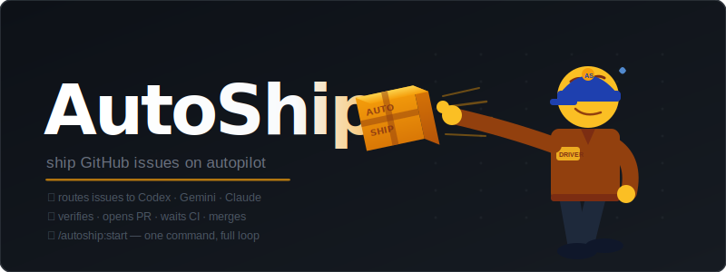

# AutoShip Wiki

AutoShip is an OpenCode-only orchestration plugin that turns GitHub issues into pull requests.

## Core Behavior

- Plans `agent:ready` issues in ascending issue-number order
- Blocks unsafe/evasion-prone work for human review
- Uses `openai/gpt-5.5` for planner, coordinator, orchestrator, and reviewer roles
- Selects worker models from the live `opencode models` inventory
- Defaults to currently available free worker models
- Allows operator-selected Spark, Go-provider, Nvidia, OpenRouter, and other OpenCode models when available
- Runs up to 15 active workers by default

## Pages

| Page | Purpose |
| --- | --- |
| [Architecture](Architecture) | Runtime flow and hook responsibilities |
| [Configuration](Configuration) | `.autoship/` files and model routing |
| [Troubleshooting](Troubleshooting) | Common recovery steps |
| [Design Decisions](Design-Decisions) | Current OpenCode-only policy decisions |
